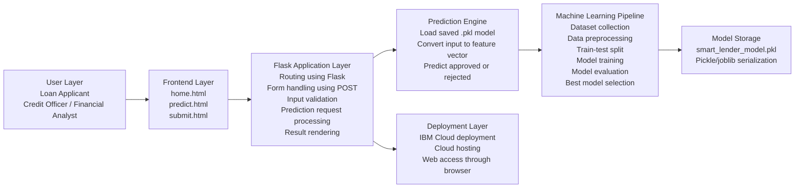

# Smart Lender Technical Architecture

Smart Lender uses a layered architecture that separates the browser interface,
Flask request handling, machine learning preprocessing, model prediction, and
cloud deployment configuration.



## 1. User Layer

The user layer represents the people who interact with the system:

- Loan applicants submit personal, income, and loan details.
- Credit officers review prediction results for faster approvals.
- Financial analysts use the results to support high-volume evaluation.

## 2. Frontend Layer

The frontend layer is implemented with Flask HTML templates:

- `home.html`: dashboard, model status, and project overview
- `predict.html`: applicant data entry form
- `submit.html`: loan approval or rejection result
- `architecture.html`: technical architecture view

The interface is responsive and displays applicant inputs, model readiness,
prediction confidence, and supporting charts.

## 3. Flask Application Layer

The Flask layer is implemented in `app.py` and handles:

- URL routing
- Form submission through POST requests
- Input validation
- Prediction request processing
- Rendering the result template

Invalid or missing fields are rejected before the model is called.

## 4. Prediction Engine

The prediction engine is implemented in `src/predict.py`.

It loads the saved model file, converts user inputs into the same feature schema
used during training, calls the classifier, and returns:

- Loan decision
- Risk level
- Prediction confidence
- Applicant snapshot

## 5. Machine Learning Pipeline

The training pipeline is implemented in `src/train_model.py`.

It performs:

- Dataset loading or sample dataset generation
- Missing value handling
- Categorical encoding
- Numerical feature scaling
- Stratified train-test split
- Decision Tree training
- Random Forest training
- KNN training
- XGBoost training
- Accuracy, confusion matrix, classification report, and cross-validation
- Best model selection

## 6. Model Storage

The selected model is serialized into:

- `models/smart_lender_model.pkl`
- `models/smart_lender_model.joblib`

The `.pkl` file is the primary artifact used by the Flask app. The `.joblib`
file is saved as a compatibility copy.

Current trained artifact:

| Metric | Value |
|---|---:|
| Best model | XGBoost |
| Training accuracy | 94.1% |
| Testing accuracy | 80.6% |
| Cross-validation accuracy | 75.0% |

## 7. Deployment Layer

The deployment layer contains IBM Cloud-ready configuration:

- `Procfile`
- `manifest.yml`
- `runtime.txt`
- `requirements.txt`

The cloud process runs the Flask app with:

```text
gunicorn app:app
```
