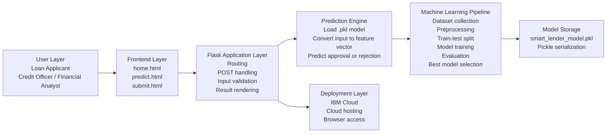

# Smart Lender

Smart Lender is a machine learning-powered Flask web application that predicts whether a loan applicant is likely to be approved. It trains and compares Decision Tree, Random Forest, K-Nearest Neighbors, and XGBoost classifiers, saves the best model, and serves real-time predictions through a clean web interface.

## Features

- Real-time loan eligibility prediction through Flask
- Structured applicant form for gender, marital status, education, employment, income, loan amount, term, credit history, and property area
- Deterministic sample loan dataset generator
- Data preprocessing with missing-value handling, categorical encoding, and numeric scaling
- Model comparison for Decision Tree, Random Forest, KNN, and XGBoost
- Saved model artifact for web deployment
- EDA plot generation with Matplotlib and Seaborn
- IBM Cloud-ready files: `Procfile`, `manifest.yml`, and `runtime.txt`

## Project Structure

```text
smart-lender-is-a-machine-learning/
├── app.py
├── requirements.txt
├── Procfile
├── runtime.txt
├── manifest.yml
├── data/
│   └── loan_applicants_sample.csv
├── docs/
│   └── technical_architecture.md
├── models/
│   ├── smart_lender_model.pkl
│   ├── smart_lender_model.joblib
│   └── model_metrics.json
├── src/
│   ├── data_generator.py
│   ├── predict.py
│   └── train_model.py
├── static/
│   ├── css/styles.css
│   ├── images/
│   └── plots/
├── templates/
│   ├── architecture.html
│   ├── base.html
│   ├── home.html
│   ├── predict.html
│   └── submit.html
└── tests/
    └── test_app.py
```

## Setup

Create and activate a virtual environment:

```powershell
python -m venv .venv
.\.venv\Scripts\Activate.ps1
```

Install dependencies:

```powershell
python -m pip install --upgrade pip
python -m pip install -r requirements.txt
```

For local retraining and chart generation, install the training extras:

```powershell
python -m pip install -r requirements-training.txt
```

Generate the dataset, train models, save the best model, and create EDA plots:

```powershell
python -m src.train_model
```

Run the Flask app:

```powershell
python app.py
```

Open:

```text
http://127.0.0.1:5000
```

Health check:

```text
http://127.0.0.1:5000/health
```

## GitHub and Deployment

Use [docs/github_deployment_guide.md](docs/github_deployment_guide.md) for the
full GitHub upload and publishing steps. The short version is:

```powershell
git init
git add .
git commit -m "Initial Smart Lender Flask ML app"
git branch -M main
git remote add origin https://github.com/YOUR_USERNAME/smart-lender.git
git push -u origin main
```

GitHub stores the code. To run the Flask app publicly, deploy the repository to
a Python host such as IBM Cloud, Render, or Railway. This project includes
`Procfile`, `manifest.yml`, `render.yaml`, and `.python-version`.

## Prediction Inputs

The application expects these fields:

- Gender
- Married
- Dependents
- Education
- Self_Employed
- ApplicantIncome
- CoapplicantIncome
- LoanAmount
- Loan_Amount_Term
- Credit_History
- Property_Area

## Model Workflow

1. Generate or load the applicant dataset.
2. Fill missing categorical values using the mode.
3. Fill missing numerical values using the median.
4. Encode categorical values with one-hot encoding.
5. Scale numerical values for model compatibility.
6. Train Decision Tree, Random Forest, KNN, and XGBoost.
7. Select the model with the best testing accuracy.
8. Save the selected model pipeline to `models/smart_lender_model.pkl`.
9. Use Flask to load the model and serve predictions.

## Current Trained Artifact

The included model artifacts were trained from the generated educational sample
dataset in `data/loan_applicants_sample.csv`.

| Metric | Value |
|---|---:|
| Best model | XGBoost |
| Training accuracy | 94.1% |
| Testing accuracy | 80.6% |
| Cross-validation accuracy | 75.0% |

These values are close to the project brief target of XGBoost around 94.7%
training accuracy and 81.1% testing accuracy while remaining reproducible from
the included dataset and training script.

## Technical Architecture



The implementation follows the reference diagram by separating the user layer,
frontend templates, Flask request layer, prediction engine, ML pipeline, model
storage, and IBM Cloud deployment configuration.

## IBM Cloud Deployment Notes

The app includes `Procfile`, `runtime.txt`, and `manifest.yml` for Cloud Foundry-style deployment. Before pushing to IBM Cloud, train the model locally so the `models/` artifacts exist.

```powershell
ibmcloud login
ibmcloud target --cf
ibmcloud cf push
```

## Important Note

The included dataset is a deterministic educational sample that mirrors the common loan eligibility dataset schema. For production banking use, replace it with institution-approved historical data, retrain, validate for fairness/compliance, and monitor model drift.
